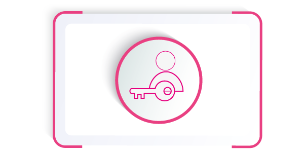

<h1><b>Phoenix</b></h1>

**SwapDex's Canary Network**

Phoenix is an early release of the code that is available and will eventually hold real economic value in the future. For developers and our community, Phoenix is a proving ground for runtime upgrades, on-chain governance, and DApps.

## **Interact with Phoenix**

<table class = "table">
<link rel="stylesheets" type="text/css" href="extra.css">
    <tr>
        <td>
            <a href="docs\Pheonix Testnet\account-generation.md">
                
                    

                        <h5>Creating an Account</h5>
                    

            </a>
        </td>
        <td>
            <a href="/docs/learn-balance-transfers">
                
                    

                        <h5>Balance Transfers</h5>
                    

            </a>
        </td>
        <td>
            <a href="/docs/learn-staking">
                
                    

                        <h5>Staking</h5>
                    

            </a>
        </td>
    </tr>
</table>

<table class = "table">
<link rel="stylesheets" type="text/css" href="extra.css">
    <tr>
        <td>
            <a href="docs\Pheonix Testnet\account-generation.md">
                
                    

                        <h5>DApps</h5>
                    

            </a>
        </td>
        <td>
            <a href="/docs/learn-balance-transfers">
                
                    

                        <h5>Bridges</h5>
                    

            </a>
        </td>
        <td>
            <a href="/docs/learn-staking">
                
                    

                        <h5>Vote for Councilors</h5>
                    

            </a>
        </td>
    </tr>
</table>

<table class = "table">
<link rel="stylesheets" type="text/css" href="extra.css">
    <tr>
        <td>
            <a href="docs\Pheonix Testnet\account-generation.md">
                
                    

                        <h5>Make a Proposal</h5>
                    

            </a>
        </td>
        <td>
            <a href="/docs/learn-balance-transfers">
                
                    

                        <h5>Council Candidacy</h5>
                    

            </a>
        </td>
        <td>
            <a href="/docs/learn-staking">
                
                    

                        <h5>Treasury</h5>
                    

            </a>
        </td>
    </tr>
</table>

<table class = "table">
<link rel="stylesheets" type="text/css" href="extra.css">
    <tr>
        <td>
            <a href="docs\Pheonix Testnet\account-generation.md">
                
                    

                        <h5>Set an Identity</h5>
                    

            </a>
        </td>
        <td>
            <a href="/docs/learn-balance-transfers">
                
                    

                        <h5>Become a Nominator</h5>
                    

            </a>
        </td>
        <td>
            <a href="/docs/learn-staking">
                
                    

                        <h5>Become a Validator</h5>
                    

            </a>
        </td>
    </tr>
</table>

Phoenix is owned by those who hold the Test SwapDex Coins (TSDX). There's no central kill switch and all changes are made through the protocol's on-chain governance. Phoenix is experimental. There are no guarantees.

Phoenix is a permissionless network and anyone can come along and start using it.

!!!hint
    As a TSDX holder, you can interact with all the features of the Phoenix network such as staking (i.e. validating or nominating), governance, DApp development, basic transfers and everything else.

**Expect Chaos.** Phoenix is getting more battle-tested day-by-day but it's built on the foundations of moving fast and trying new things.

!!! Warning
    Work in progress content can change and it's not definitive. 

## Disclaimer:

**Blockchain technologies are constantly evolving. This paper describes the best possible planned development, however due to the nature of the technology and the complexity of integrating the world of blockchain.**

**This document may be subject to change. We try to come as close as possible to the original plan, but sometimes modifications are necessary to improve the user experience and overcome technological barriers encountered during development.**

## References

* [https://substrate.dev/docs/en/knowledgebase/smart-contracts/](https://substrate.dev/docs/en/knowledgebase/smart-contracts/)
* [https://substrate.dev/docs/](https://substrate.dev/docs)

   