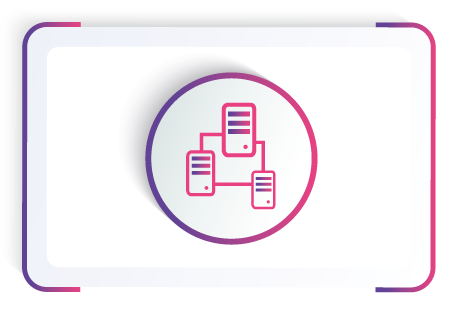
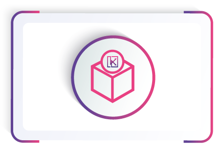
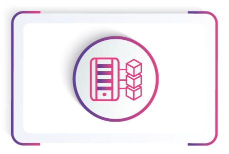
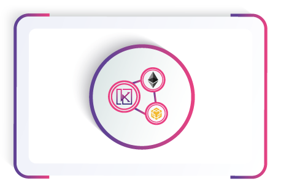
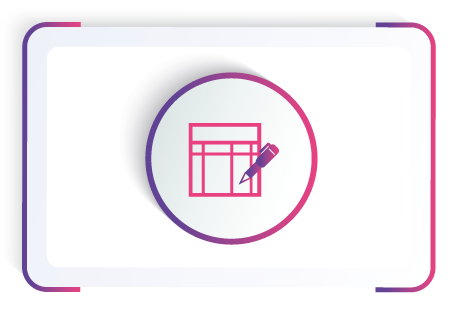
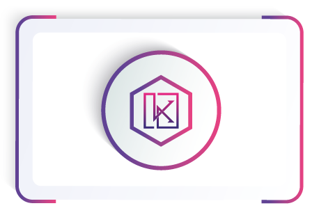
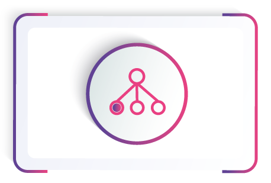

# <b>WELCOME TO</b>

---
!!! Warning
    Work in progress content can change and it's not definitive :building_construction:.

**SwapDex's Main Network**

**KUSARI** [KSI] meaning "Chain", will be a canary network for our main chain and will hold real economic value in the future, similar to our leading network SwapDEX.

Remember, we didn't send a miner down to work unless the canary came out alive. Hence, the primary purpose of KUSARI is to test the reliability of new developments before deploying them on the main network.

**KUSARI** will be a "Break it chain" (if you can, of course), and with this, we shall be giving out bounties to developers and hackers alike to come onto KUSARI and do their worst! 

!!! Hint
    **EXPECT CHAOS** :fire:

## **Interact with Kusari**
---
<table class = "table">
<link rel="stylesheets" type="text/css" href="extra.css">
    <tr>
        <td>
            <a href="https://kusari-network.github.io/kusari-docs/what-to-try/account-generation/" target="_blank">
                
                    

                        <h5>Creating an Account</h5>
                    

            </a>
        </td>
        <td>
            <a href="https://kusari-network.github.io/kusari-docs/get-started/transfer-balances/" target="_blank">
                
                    

                        <h5>Balance Transfers</h5>
                    

            </a>
        </td>
        <td>
            <a href="https://kusari-network.github.io/kusari-docs/deep-dives/staking/" target="_blank">
                
                    

                        <h5>Staking</h5>
                    

            </a>
        </td>
    </tr>
</table>

<table class = "table">
<link rel="stylesheets" type="text/css" href="extra.css">
    <tr>
        <td>
            <a href="https://kusari-network.github.io/kusari-docs/dev-guides/" target="_blank">
                
                    

                        <h5>DApps</h5>
                    

            </a>
        </td>
        <td>
            <a href="https://kusari-network.github.io/kusari-docs/deep-dives/bridges/" target="_blank">
                
                    

                        <h5>Bridges</h5>
                    

            </a>
        </td>
        <td>
            <a href="https://kusari-network.github.io/kusari-docs/what-to-try/democracy/" target="_blank">
                
                    

                        <h5>Vote for Councilors</h5>
                    

            </a>
        </td>
    </tr>
</table>

<table class = "table">
<link rel="stylesheets" type="text/css" href="extra.css">
    <tr>
        <td>
            <a href="https://kusari-network.github.io/kusari-docs/what-to-try/democracy/" target="_blank">
                
                    

                        <h5>Make a Proposal</h5>
                    

            </a>
        </td>
        <td>
            <a href="https://kusari-network.github.io/kusari-docs/what-to-try/democracy/" target="_blank">
                
                    

                        <h5>Council Candidacy</h5>
                    

            </a>
        </td>
        <td>
            <a href="https://kusari-network.github.io/kusari-docs/what-to-try/treasury/" target="_blank">
                
                    

                        <h5>Treasury</h5>
                    

            </a>
        </td>
    </tr>
</table>

<table class = "table">
<link rel="stylesheets" type="text/css" href="extra.css">
    <tr>
        <td>
            <a href="https://kusari-network.github.io/kusari-docs/what-to-try/identity/" target="_blank">
                
                    

                        <h5>Set an Identity</h5>
                    

            </a>
        </td>
        <td>
            <a href="https://kusari-network.github.io/kusari-docs/what-to-try/nominator/" target="_blank">
                
                    

                        <h5>Become a Nominator</h5>
                    

            </a>
        </td>
        <td>
            <a href="https://docs.kusari.network/validator-guides/validator/" target="_blank">
                
                    

                        <h5>Become a Validator</h5>
                    

            </a>
        </td>
    </tr>
</table>
---
Kusari is owned by those who held the SwapDex ERC-20 Token. All hodlers will receive a 1/100 airdrop on mirgration day. If you want become a part of Kusari after the airdrop, you need to buy the KSI coin or do something cool for the community to receive tips.

There's no central kill switch and all changes are made through the protocol's on-chain governance. Kusari is experimental. There are no guarantees.

Kusari is a permissionless network and anyone can come along and start using it.

!!!hint
    As a KSI holder, you can interact with all the features of the Kusari network such as staking (i.e. validating or nominating), governance, DApp development, basic transfers and everything else.

**Expect Chaos.** Kusari is getting more battle-tested day-by-day but it's built on the foundations of moving fast and trying new things.

## **Disclaimer:**

**Blockchain technologies are constantly evolving. This paper describes the best possible planned development, however due to the nature of the technology and the complexity of integrating the world of blockchain.**

**This document may be subject to change. We try to come as close as possible to the original plan, but sometimes modifications are necessary to improve the user experience and overcome technological barriers encountered during development.**

## **References**

* [https://substrate.dev/docs/en/knowledgebase/smart-contracts/](https://substrate.dev/docs/en/knowledgebase/smart-contracts/)
* [https://substrate.dev/docs/](https://substrate.dev/docs)

  

 Written by Petar 
